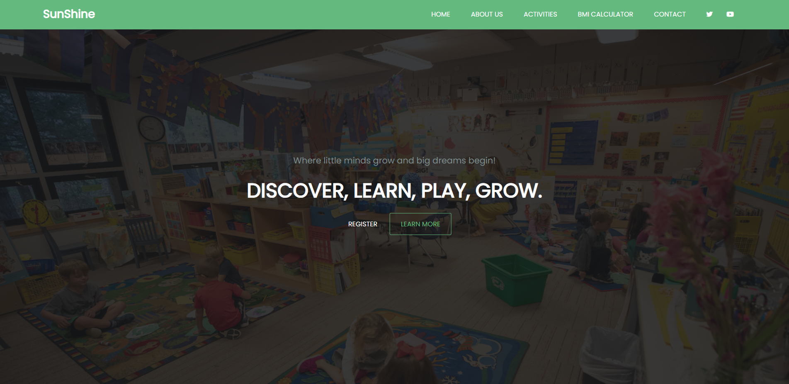
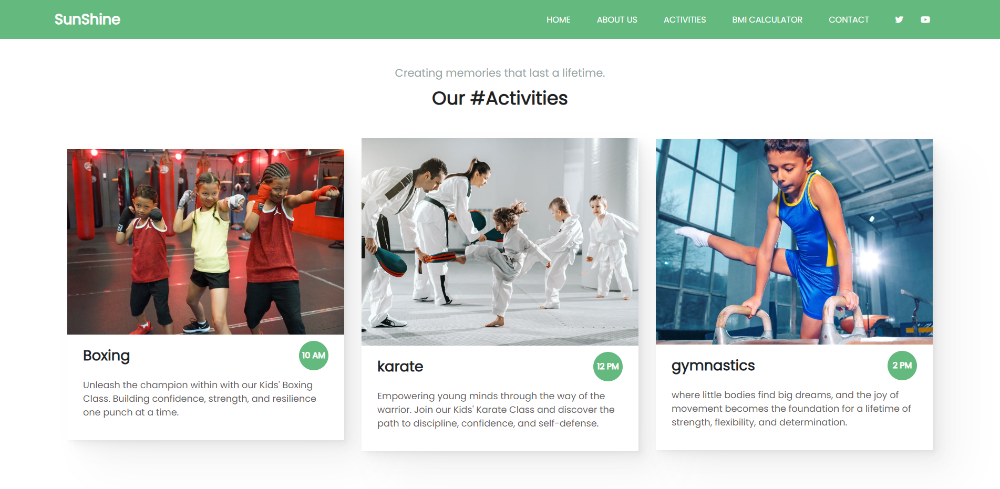
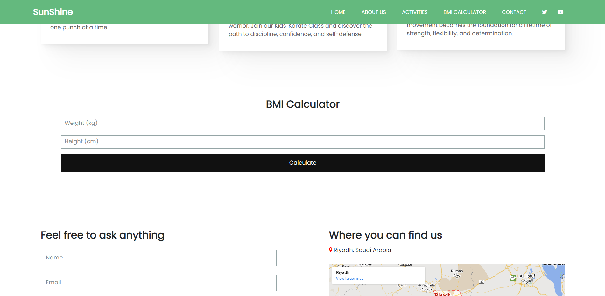
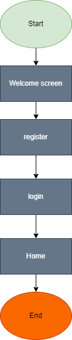

# Sunshine Gym website

## Overview

The Sunshine Gym website is designed to provide users with a new way to embrace an active lifestyle. It offers various features such as information about our gym space, Activities, a BMI calculator, and contact details. The goal of the project is to create an engaging and informative website for users interested.

### Screenshots

Include screenshots of the different sections of the website to provide an overview of its design and layout.

- Home Page
  

- Activities Page
  

- BMI Calculator
  

## Technologies Used

- HTML
- CSS
- JavaScript
- Node.js
- Express
- MongoDB

## User Interaction Flow

The user experience on the website can be summarized using the following flowchart:

## Getting Started

To run the project locally, follow these steps:

1. Clone the repository: `git clone https://github.com/NuarAldusimani-13/WebProject.git`
2. Install dependencies: `npm install`
3. Start MongoDB: `mongod`
4. Start the server: `node app.js`
5. Open the website in your browser: `http://localhost:3000`

group members :
Arwa Aldosari 440023487
Razan Alqahtani 441018675
Btool Alotaibi 441018409
Nuar Aldsimani 441018410
